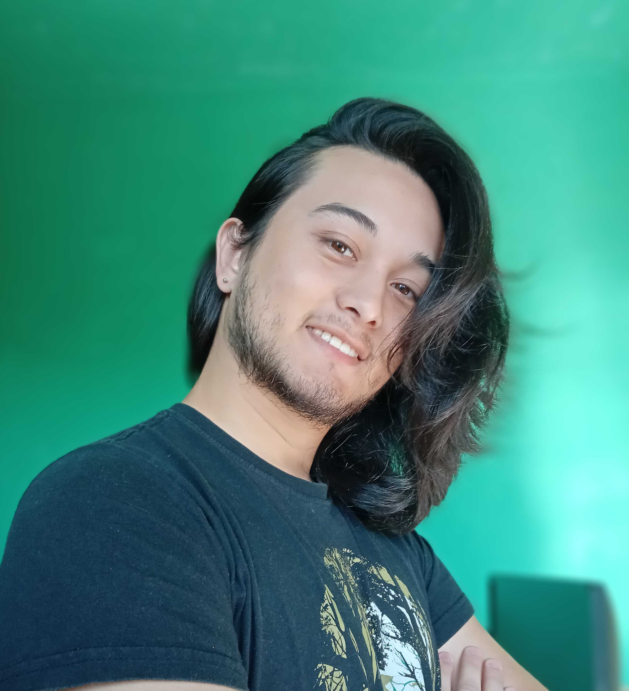

## **About Myself**

---

Hi! I'm Isamu, a **Software / Game Developer** currently delving in **User Experience** (**UX**).

---

## **Knowledge**

<table markdown="1"> <tr>
    <td style="text-align:center;vertical-align:middle;width:33em;">  
!!! code-language "Languages"
    ABAP

    C/C++

    C#

    Javascript

    Python
 
    </td>
    <td style="text-align:center;vertical-align:top;width:33em;">  
!!! game-engine "Game Engines"
    Unity

    Godot

    GameMaker Studio 2
 
    </td>
    <td style="text-align:center;vertical-align:top;width:33em;">  
!!! agile "Agile Methodology"
    Scrum

    Kanban
 
    </td>
</tr> </table>

## **Projects**

[Click here to check what I'm currently working on!](Projects/){ .md-button }

